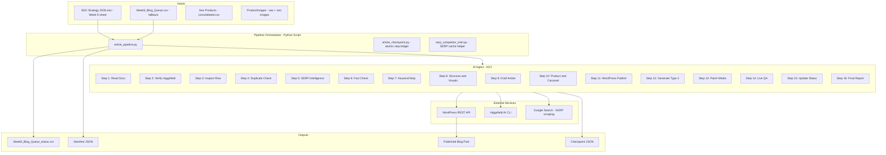
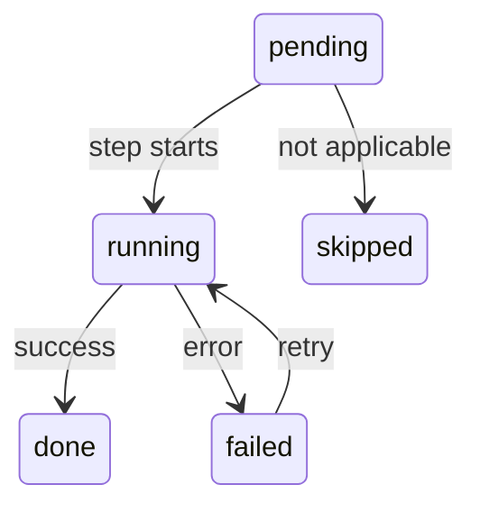

# BlueStone SEO Blog Generation Pipeline - Complete Architecture Reference

**Version:** 2026-09-25 | **Client:** BlueStone (Indian Jewellery E-Commerce)
**Pipeline:** Week 9 (current production) | **Workspace:** `seo final 2026`

---

## 1. System Overview



---

## 2. File and Directory Structure

```
seo final 2026/
|-- SEO Strategy 2026.xlsx          # Master strategy workbook (Week 9 sheet)
|-- HANDOFF.md                      # Project context and state handoff
|
|-- docs/                           # Editorial guidelines and SOPs
|   |-- SOP_ARTICLE_GENERATION.md   # Primary execution runbook
|   |-- ARTICLE_WORKFLOW.md         # Canonical article workflow rules
|   |-- ARTICLE_ENGINES_PLAYBOOK.md   # Engine selection: Gift/Buying/Design
|   |-- bluestone-blog-master-prompt-v5.md  # Master drafting prompt
|   |-- Blog-SEO-AEO-GEO-Checklist-v2.md   # Pre-publish QA checklist
|   |-- HIGGSFIELD_IMAGE_GENERATION.md      # Higgsfield image SOP
|   |-- competitor-blog-analysis-SKILL.md   # Competitor analysis template
|
|-- cursor-rules/                   # Agent behavioral rules
|   |-- new-blogs-only.mdc          # Only create new posts, never optimize old
|   |-- carousel-seo-images.mdc     # Carousel image sourcing rules
|   |-- type3-fair-skinned-indians.mdc  # Type 3 diversity guidelines
|   |-- image-seo.mdc              # Image SEO (alts, filenames, WebP)
|   |-- product-rotation-captions-education.mdc  # Product rotation rules
|
|-- templates/
|   |-- eid_carousel_6_snippet.html # 3D Coverflow carousel HTML/CSS/JS
|   |-- type3_prompts.json          # Higgsfield prompt templates
|
|-- scripts/                        # All pipeline and helper scripts
|   |-- article_pipeline.py           # Main orchestrator (current)
|   |-- article_checkpoint.py         # Atomic checkpoint manager
|   |-- week6_checkpoint.py         # Shared STEPS definition
|   |-- week6_pipeline.py           # Shared utilities (common module)
|   |-- serp_competitor_intel.py    # SERP intelligence helper
|   |-- publish_week1_generic.py    # WordPress publish helper
|
|-- output/                         # All generated artifacts
|   |-- Week9_Blog_Queue.csv        # Queue CSV (fallback source)
|   |-- Week9_Blog_Queue_status.csv # Terminal status tracker
|   |-- product_rotation.json       # SKU rotation state
|   |-- serp_cache/                 # Cached SERP results (per-keyword)
|   |-- checkpoints/                # Per-rank checkpoint JSONs
|
|-- ProductImages/
|   |-- raw/                        # Type 1: Original studio shots (reference)
|   |-- seo images/                 # Type 2: Styled product shots (carousel)
|
|-- Seo Products - consolidated.csv # Product catalog with PDP URLs
```

---

## 3. The 16-Step Pipeline (Detailed)

### Phase 1: Initialization and Safety Gates

#### Step 1: Read Required Documents

| Attribute | Detail |
|---|---|
| **Checkpoint name** | `read_docs` |
| **Executed by** | AI Agent |
| **What happens** | Agent reads all editorial guidelines, SOPs, and cursor rules into context |
| **Documents loaded** | HANDOFF.md, SOP_ARTICLE_GENERATION.md, ARTICLE_WORKFLOW.md, ARTICLE_ENGINES_PLAYBOOK.md, HIGGSFIELD_IMAGE_GENERATION.md, Blog-SEO-AEO-GEO-Checklist-v2.md, all 5 cursor-rules .mdc files |

#### Step 2: Verify Higgsfield AI

| Attribute | Detail |
|---|---|
| **Checkpoint name** | `verify_higgsfield` |
| **Executed by** | AI Agent runs `higgsfield account status --json` |
| **What happens** | Confirms Higgsfield credits, plan status, and CLI connectivity |
| **Failure behavior** | Stops before any image generation attempt |

#### Step 3: Inspect the Target Row

| Attribute | Detail |
|---|---|
| **Checkpoint name** | `inspect_row` |
| **Executed by** | AI Agent (data pre-loaded by article_pipeline.py script) |
| **What happens** | Agent validates the target keyword, slug, volume, KD, theme, engine, and category fit |
| **Data source** | SEO Strategy 2026.xlsx Week 9 sheet (or Week9_Blog_Queue.csv fallback) |

#### Step 4: Duplicate and Intent Gate

| Attribute | Detail |
|---|---|
| **Checkpoint name** | `duplicate_check` |
| **Executed by** | AI Agent queries WordPress REST API |
| **What happens** | Checks if the target URL slug or identical search intent already exists on blog.bluestone.com |
| **If duplicate found** | Pipeline halts safely. No API calls, no content generated. Checkpoint marked skipped_existing_intent |
| **Override** | `--allow-existing-intent` flag (requires `--restart`) |

---

### Phase 2: SERP Research and Strategy (NEW)

#### Step 5: SERP Intelligence (NEW)

| Attribute | Detail |
|---|---|
| **Checkpoint name** | `serp_intelligence` |
| **Executed by** | AI Agent (searches Google + scrapes URLs) |
| **What happens** | 1. Agent searches Google India for the primary keyword. 2. Identifies top 5 organic ranking URLs. 3. Scrapes/reads each page full content. 4. Extracts: title, H2/H3 outline, subtopics, FAQs, word count. 5. Synthesizes a SERP Competitive Brief |
| **Output logged** | `SERP_SCRAPED: pos, url, domain, word_count, h2_count` per URL |
| **Brief contains** | a) Consensus topics (appear in 3+ pages), b) Common FAQs, c) Content gaps, d) Intent format, e) Average word count |
| **Semrush fallback** | If Semrush API data is cached in output/serp_cache/, pre-fetched URLs are provided directly |
| **Purpose** | Ensures article covers what Google currently rewards + identifies gaps for differentiation |

#### Step 6: Fact-Check and Compliance

| Attribute | Detail |
|---|---|
| **Checkpoint name** | `fact_check` |
| **Executed by** | AI Agent (browses authoritative sources when needed) |
| **What happens** | Verifies factual accuracy for buying/education topics. Enforces: correct festival year, no fake stats, no prices, no competitor criticism |
| **Conditional** | BIS hallmark / GST / purity checks only triggered when keyword intent demands it (buying guides, not gift guides) |

---

### Phase 3: Content Architecture

#### Step 7: Keyword Mapping and H2 Spine

| Attribute | Detail |
|---|---|
| **Checkpoint name** | `keyword_map` |
| **Executed by** | AI Agent |
| **What happens** | Maps primary + supporting keywords into H2/H3 headings and FAQ questions |
| **Labeling** | Each H2 labeled as: primary-backed, supporting-keyword-backed, competitor-structure-backed, serp-consensus-backed, or intent-inferred |
| **Engine selection** | Gift Guide, Buying Guide / Education, or Design Listicle (from ARTICLE_ENGINES_PLAYBOOK.md) |

#### Step 8: Article Structure and Visual Concept

| Attribute | Detail |
|---|---|
| **Checkpoint name** | `structure_visuals` |
| **Executed by** | AI Agent |
| **What happens** | Defines article outline, visual layout (hero + in-body Type 3 + carousel placement), and section ordering |
| **Section order** | Intro, Body H2s, Carousel (mid-article), More H2s, Related Guides, Conclusion, FAQs, JSON-LD |

---

### Phase 4: Content Production

#### Step 9: Full Article Draft

| Attribute | Detail |
|---|---|
| **Checkpoint name** | `draft` |
| **Executed by** | AI Agent (following Master Prompt v5) |
| **Drafting guide** | docs/bluestone-blog-master-prompt-v5.md |
| **Key rules** | Single h1 (template-rendered), zero em/en dashes, 4+ internal links + 1+ external, 5-7 visible FAQs, FAQPage + BlogPosting JSON-LD, Gutenberg block syntax, author = Satyam (ID 270271337) |
| **Output** | Complete Gutenberg HTML article body |

#### Step 10: Product Curation and 3D Coverflow Carousel

| Attribute | Detail |
|---|---|
| **Checkpoint name** | `product_media` |
| **Executed by** | AI Agent |
| **Product source** | Seo Products - consolidated.csv (PDP links, no prices) |
| **SKU count** | 5-6 products per article |
| **Carousel template** | templates/eid_carousel_6_snippet.html |
| **Carousel format** | Single wp:html block containing style, div.bs-cf, and script |
| **Image source** | Type 2 styled images from ProductImages/seo images/ (960x535 WebP) |
| **Pre-flight** | Every carousel image URL verified HTTP 200 before insertion |

---

### Phase 5: Publishing and Visual Production

#### Step 11: WordPress Publish and Yoast SEO

| Attribute | Detail |
|---|---|
| **Checkpoint name** | `publish_wordpress` |
| **Executed by** | AI Agent calls WordPress REST API |
| **API auth** | WP_USER + WP_APP_PASSWORD (environment variables) |
| **What happens** | Creates new post with Gutenberg HTML, sets categories, assigns author |
| **Yoast config** | Focus Keyphrase, SEO Title (CTR-optimized), Meta Description |
| **Exactly-once** | If slug already exists from this run, reuses the post. Never creates duplicates |

#### Step 12: Higgsfield AI Image Generation (Type 3)

| Attribute | Detail |
|---|---|
| **Checkpoint name** | `generate_type3` |
| **Executed by** | AI Agent runs Higgsfield CLI commands |
| **Model** | nano_banana_pro, 16:9 aspect, 2K resolution |
| **Slots** | Hero image + 1-2 in-body lifestyle/conceptual images |
| **Style** | Analog grain, Kodak Portra color science, highlight halation, creamy bokeh, editorial color grading |
| **Constraints** | Max 2 concurrent generations; 45s wait + 1 retry on error; no text/logos/screens in images |
| **Output** | WebP files with keyword-rich filenames |

#### Step 13: Media Patching and Social Metadata

| Attribute | Detail |
|---|---|
| **Checkpoint name** | `patch_type3` |
| **Executed by** | AI Agent via WordPress Media Library API |
| **What happens** | Uploads Type 3 images, sets featured hero, updates in-body image blocks, configures OpenGraph + Twitter Card meta |
| **Image SEO** | Unique alt text with keyword + year, descriptive media library titles, sizeSlug: full only |

---

### Phase 6: Quality Assurance and Finalization

#### Step 14: Live QA Verification

| Attribute | Detail |
|---|---|
| **Checkpoint name** | `live_qa` |
| **Executed by** | AI Agent (fetches live published URL) |
| **Checks** | Single h1, image rendering, WebP format, alt tags, carousel .bs-cf elements, all 6 card images HTTP 200, visible word count, FAQ schema, BlogPosting schema, internal links, og:image, canonical URL, no forbidden dashes/prices |
| **Pass criteria** | Checkpoint detail result=passed |

#### Step 15: Status Update

| Attribute | Detail |
|---|---|
| **Checkpoint name** | `update_status` |
| **Executed by** | Agent marks checkpoint then article_pipeline.py runs upsert_status_record() |
| **Files updated** | output/Week9_Blog_Queue_status.csv (upsert by rank), output/product_rotation.json |

#### Step 16: Final Report

| Attribute | Detail |
|---|---|
| **Checkpoint name** | `final_report` |
| **Executed by** | AI Agent |
| **Report includes** | Live URL, WP post ID, engine, author, categories, word count, primary keyword + metrics, supporting keywords used/rejected, SERP intelligence (URLs scraped with word counts, consensus topics, gaps), H2 keyword map with labels, competitor analysis summary, factual sources, carousel + Type 3 media IDs, product SKUs + rotation, Higgsfield credits, duplicate result, og:image verification |

---

## 4. The Mega-Prompt Architecture

The pipeline orchestrator (article_pipeline.py) builds a single mega-prompt that is sent to the AI agent. This prompt contains everything the agent needs to execute Steps 1-16 autonomously.

### Prompt Structure

```
 1. Document read list (10 files)
 2. Target row data (keyword, volume, KD, slug, etc.)
 3. Duplicate-intent handling rules
 4. SERP intelligence block (top 5 URLs or Google search instruction)  <-- NEW
 5. Checkpoint and idempotency rules
 6. Mandatory content gates (30+ rules)
 7. Mandatory image gates (15+ rules)
 8. WordPress and live QA rules
 9. Timer/progress display format
10. Final report required fields
```

### Prompt Generation Function

- **File:** scripts/article_pipeline.py, function prompt_for_rank()
- **Location:** Line ~560
- **Inputs:** Row data, engine, category hint, timers flag, checkpoint path, checkpoint state, allow_existing_intent flag
- **Output:** ~3,000-word text prompt string
- **Audit trail:** Saved to output/week9_rank{N}_{slug}_{timestamp}.prompt.txt

---

## 5. Checkpoint System

Each rank has an atomic JSON checkpoint at `output/checkpoints/week9_rank{N}.json`.

### Step States

| Status | Meaning |
|---|---|
| `pending` | Step has not started |
| `running` | Step is in progress |
| `done` | Step completed successfully |
| `failed` | Step failed (agent or script error) |
| `skipped` | Step intentionally skipped |

### Checkpoint Lifecycle



### Step Names (in order)

```
read_docs, verify_higgsfield, inspect_row, duplicate_check,
serp_intelligence, fact_check, keyword_map, structure_visuals,
draft, product_media, publish_wordpress, generate_type3,
patch_type3, live_qa, update_status, final_report
```

### Checkpoint Commands

```bash
# Initialize
python3 -B scripts/article_checkpoint.py init --path <path> --rank <N> --slug <slug> --primary "<keyword>"

# Mark step status
python3 -B scripts/article_checkpoint.py mark --path <path> --step <step_name> --status done --detail key=value

# View checkpoint
python3 -B scripts/article_checkpoint.py show --path <path>
```

---

## 6. Image System (3 Types)

| Type | What | Source | Usage |
|---|---|---|---|
| **Type 1 (Raw)** | Original studio jewellery photos | ProductImages/raw/ | Reference ONLY for generating Type 2/3 prompts |
| **Type 2 (AI Product)** | Styled product shots on plinths/fabric | ProductImages/seo images/ | Carousel cards (mid-article) 960x535 WebP |
| **Type 3 (AI Concept)** | Lifestyle/atmosphere scenes | Generated by Higgsfield CLI (nano_banana_pro) | Featured hero + in-body editorial images |

### Higgsfield Generation Rules

- Model: nano_banana_pro, 16:9, 2K resolution, count 1 per slot
- Style: Analog grain, Kodak Portra, halation, creamy bokeh, editorial grading
- Max 2 concurrent generations; 45s wait + 1 retry on error
- No text, logos, screens, phones, cards, or product overlays
- Extract result URL from job result_url field

---

## 7. Article Content Engines

The engine determines the article structure, tone, and visual approach.

| Engine | Keyword Type | H2 Structure | Product Integration |
|---|---|---|---|
| **Gift Guide** | "gifts for sister", "rakhi gifts" | Recipient segments, occasion guide, decision framework | 5-6 named SKU recommendations with gifting reasons |
| **Buying Guide / Education** | "how to check gold purity", "916 hallmark" | Technical explainers, calculations, regulations | Educational with linked reference products |
| **Design Listicle** | "gold ring designs", "latest earrings" | Style categories, trend analysis, outfit pairing | Design showcase with curated collections |

### Engine Selection Logic

- **File:** scripts/article_pipeline.py, function engine_for(row) calls week6_pipeline.engine_for(row)
- **Uses:** theme and category_fit columns from the workbook row

---

## 8. WordPress Publishing

### API Configuration

```bash
export WP_USER='blogbluestone'
export WP_APP_PASSWORD='<application password>'
```

**Base URL:** https://blog.bluestone.com/wp-json/wp/v2/

### Category Mapping

| Article Intent | WordPress Categories |
|---|---|
| General gift guide | Gift (554493424) |
| Seasonal/festival gift guide | Gift + Festive Wishes (554493477) |
| Wedding/couple jewellery | Gift + Wedding Jewellery (554493443) |
| Gold buying/purity guide | Gold (554493348) + Jewellery Problem and Solution (554493465) |
| Design listicle/style | Jewellery Trends (554493317) or Jewellery and Lifestyle (554493425) |

### Yoast SEO Fields (set via REST API)

- Focus Keyphrase = primary keyword
- SEO Title = CTR-optimized title with keyword
- Meta Description = compelling 155-char summary

---

## 9. Running the Pipeline

### Standard Production Command

```bash
python3 -B scripts/article_pipeline.py produce \
  --ranks 69 \
  --manifest output/week9_69.json \
  --timers \
  --approve-for-me
```

### Key CLI Options

| Flag | Purpose |
|---|---|
| `--ranks 69` or `--ranks 69-73` | Specific rank(s) to generate |
| `--next` or `--next 3` | Auto-pick next N unfinished New ranks |
| `--manifest <path>` | Run manifest JSON (audit trail) |
| `--timers` | Enable step-by-step timing display |
| `--approve-for-me` | Auto-approve agent workspace writes |
| `--dry-run` | Build prompt only, do not launch agent |
| `--verbose` | Stream full agent output to terminal |
| `--restart` | Archive old checkpoint and start fresh |
| `--allow-existing-intent` | Override duplicate-intent gate (requires --restart) |
| `--force` | Rerun already-completed ranks |
| `--runner agy` | Use AGY agent (default) |
| `--model <name>` | Specify AI model for AGY |

### Terminal Output (with --timers)

```
================================================================================
Week 9 Rank 69: light earrings (Runner: agy)
Engine: buying_guide
================================================================================

STEP START: read_docs | time: 15:50:00 | elapsed: 0s
step 1: read_docs | completed in 1m 12s
step 2: verify_higgsfield | completed in 21s
step 3: inspect_row | completed in 23s
step 4: duplicate_check | completed in 1m 0s
step 5: serp_intelligence | completed in 2m 30s     <-- NEW STEP
step 6: fact_check | completed in 13s
...
step 16: final_report | completed in 24s
```

---

## 10. Data Flow Diagram

```mermaid
flowchart LR
    subgraph INPUT
        XLSX["SEO Strategy 2026.xlsx"]
        CATALOG["Product Catalog CSV"]
    end

    subgraph PIPELINE["article_pipeline.py"]
        LOAD["Load rows and select rank"]
        PROMPT["Build mega-prompt"]
        LAUNCH["Launch AGY agent"]
        FINALIZE["Finalize checkpoint"]
        UPSERT["Upsert status CSV"]
    end

    subgraph AGENT_WORK["AI Agent Session"]
        SERP["Google top 5 and scrape URLs"]
        DRAFT["Draft article with Master Prompt v5"]
        CAROUSEL["Build carousel with 6 products"]
        PUBLISH["WordPress publish"]
        TYPE3["Higgsfield image gen"]
        PATCH["Patch images and social meta"]
        QA["Live QA verification"]
    end

    subgraph OUTPUT
        BLOG["Live Blog on blog.bluestone.com"]
        CSV_OUT["Status CSV"]
        CKPT_OUT["Checkpoint JSON"]
    end

    XLSX --> LOAD
    CATALOG --> CAROUSEL
    LOAD --> PROMPT
    PROMPT --> LAUNCH
    LAUNCH --> AGENT_WORK
    SERP --> DRAFT
    DRAFT --> CAROUSEL
    CAROUSEL --> PUBLISH
    PUBLISH --> TYPE3
    TYPE3 --> PATCH
    PATCH --> QA
    QA --> FINALIZE
    FINALIZE --> UPSERT
    PUBLISH --> BLOG
    UPSERT --> CSV_OUT
    FINALIZE --> CKPT_OUT
```



---

## 11. Key Design Decisions

### Why a single agent session?

All 16 steps run in one continuous AI agent invocation rather than separate calls per step. This gives the agent full context (competitor research informs the draft, product selection informs visuals, etc.) and avoids context fragmentation.

### Why atomic checkpoints?

Each step is atomically marked in a JSON file with file-system locking. If the agent crashes mid-run, restarting skips completed steps and resumes from the last pending step. WordPress post creation is exactly-once to prevent duplicate posts.

### Why the 3D Coverflow carousel?

An interactive carousel (not static images) increases time-on-page and scroll depth, which are indirect SEO ranking signals. It embeds real PDP links for conversion while keeping the editorial feel (approximately 80% content, 20% brand).

### Why SERP intelligence before drafting?

Analyzing what Google currently ranks ensures the article covers consensus topics (table stakes) and identifies gaps where BlueStone can provide superior depth. This is the difference between writing "a good article" and writing "the article that should rank number 1."

---

## 12. Error Recovery

| Scenario | Recovery |
|---|---|
| Agent crashes mid-step | Rerun same command; checkpoint skips completed steps |
| WordPress duplicate slug | Agent stops safely; reconcile manually |
| Higgsfield generation fails | 45s wait + 1 automatic retry; if still fails, step marked failed |
| Duplicate search intent found | Pipeline halts with skipped_existing_intent outcome |
| Previous run left incomplete checkpoint | Use --restart to archive old checkpoint and start fresh |

---

## 13. Monitoring and Status

### Status CSV

- **File:** output/Week9_Blog_Queue_status.csv
- **Columns:** rank, primary, slug, blog_url, wp_post_id, status, carousel_media, type3_media, lines, visible_words, notes

### Manifest JSON

- **File:** output/week9_{ranks}.json
- **Contains:** all run metadata, timing, exit codes, outcomes, per-rank details

### Checkpoint JSON

- **File:** output/checkpoints/week9_rank{N}.json
- **Contains:** per-step status/timing, WordPress post ID, live URL, media IDs, outcome

---

*Document generated: 2026-09-25 | Pipeline version: Week 9 with SERP Intelligence*
